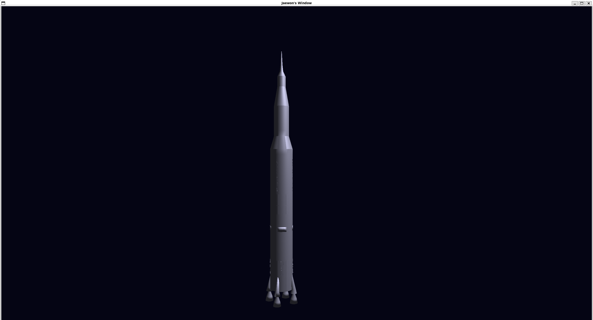
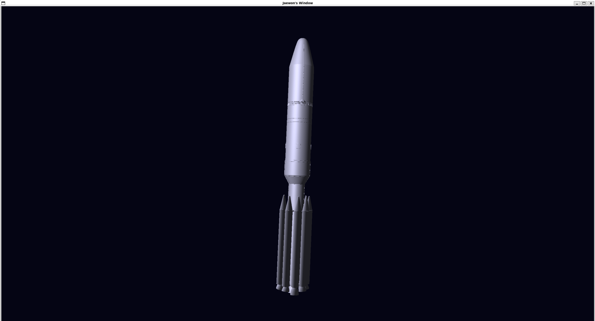
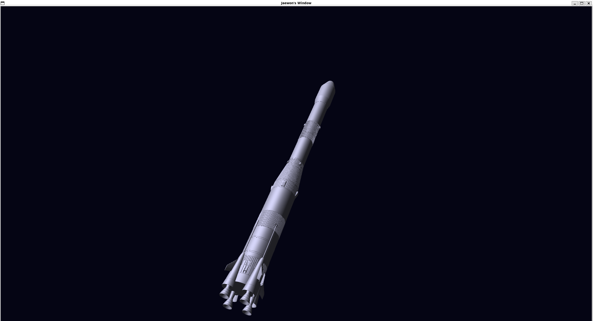
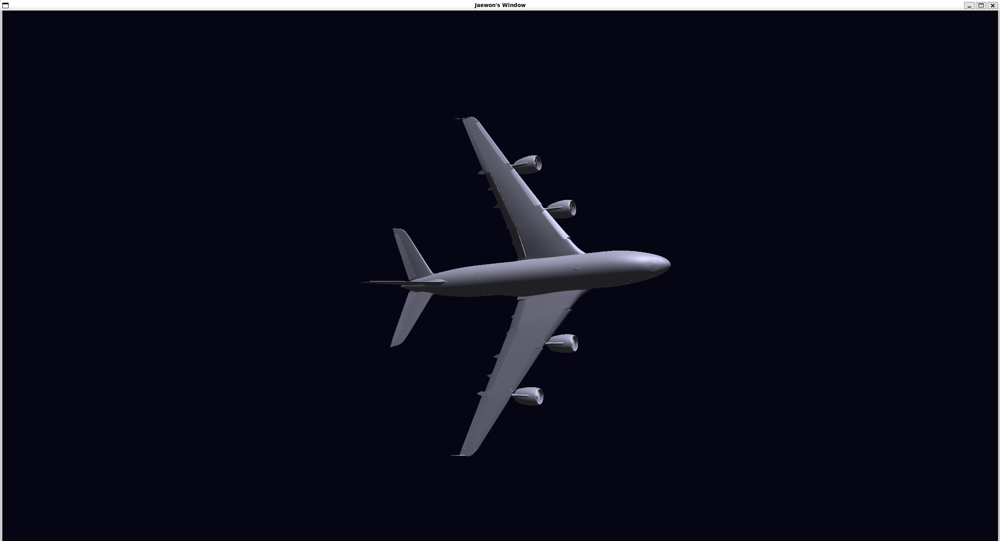
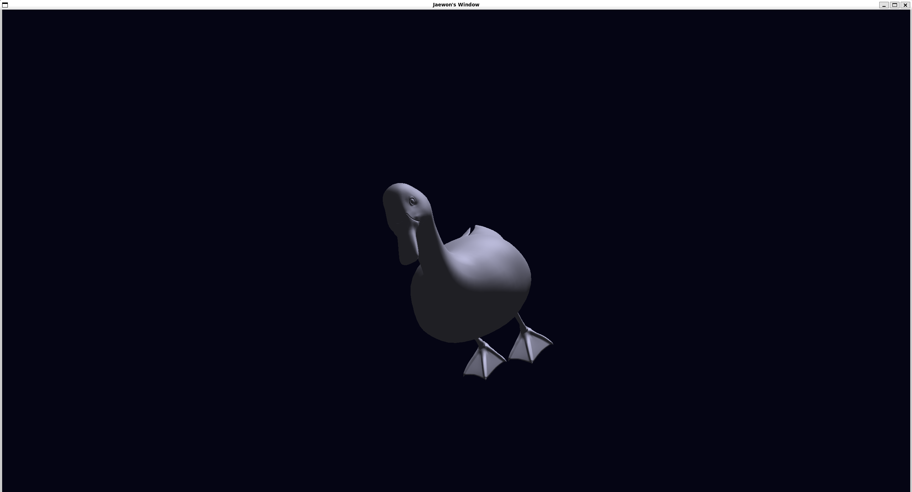
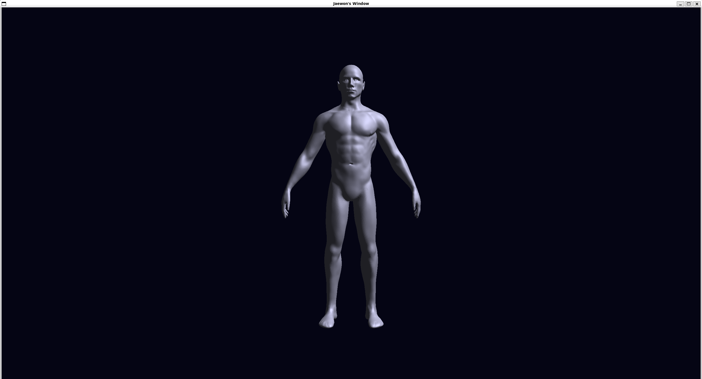

# Rocket Simulation

A 3D OpenGL-based rocket simulation with an interactive camera system.


## Features

- 3D model rendering using OpenGL 3.3 Core Profile
- Orbital camera controls (rotate and zoom)
- OBJ model loading with Assimp
- Custom shader support

## Screenshots

The following are some 3D models rendered using this application








## Controls

| Key | Action |
|-----|--------|
| `W` | Rotate camera up |
| `S` | Rotate camera down |
| `A` | Rotate camera left |
| `D` | Rotate camera right |
| `Scroll` | Zoom in/out |
| `ESC` | Exit application |

## Dependencies

- OpenGL 3.3+
- GLFW 3.4+
- GLM
- Assimp
- GLAD

### Installing Dependencies (Ubuntu/Debian)

```bash
sudo apt update
sudo apt install libglfw3-dev libglm-dev libassimp-dev
```

## Building

```bash
mkdir build
cd build
cmake ..
make
```

## Running

```bash
./rocket-simulation
```

## Project Structure

```
rocket-simulation/
├── CMakeLists.txt
├── README.md
├── header/
│   ├── window.h
│   ├── shader.h
│   ├── mesh.h
│   └── renderer.h
├── src/
│   ├── main.cpp
│   ├── window.cpp
│   ├── shader.cpp
│   ├── mesh.cpp
│   ├── renderer.cpp
│   └── glad.c
├── shaders/
    ├── cube.vert
    └── cube.frag
```

## License

MIT License